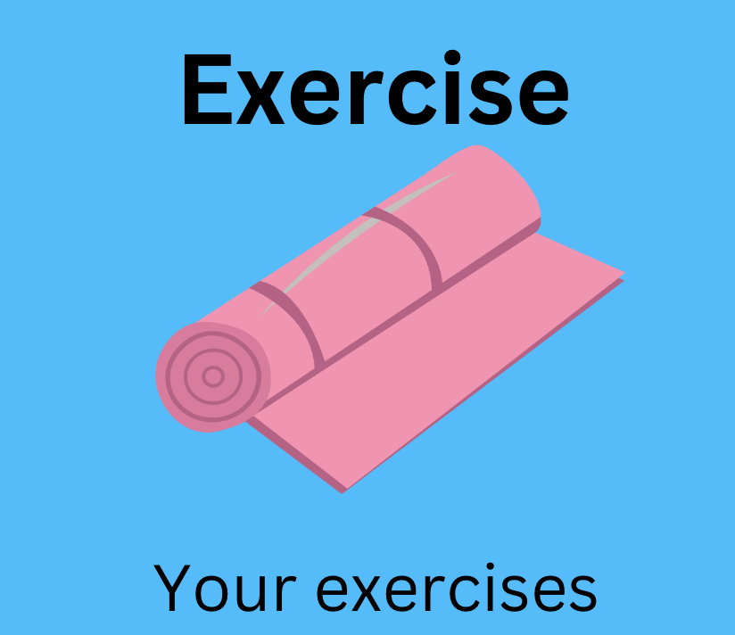
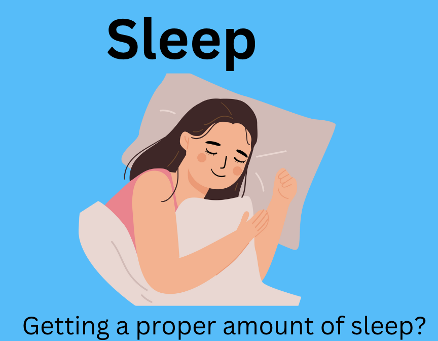
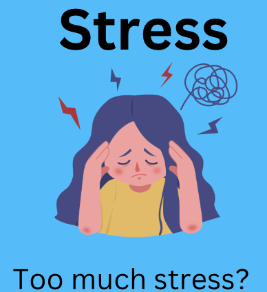
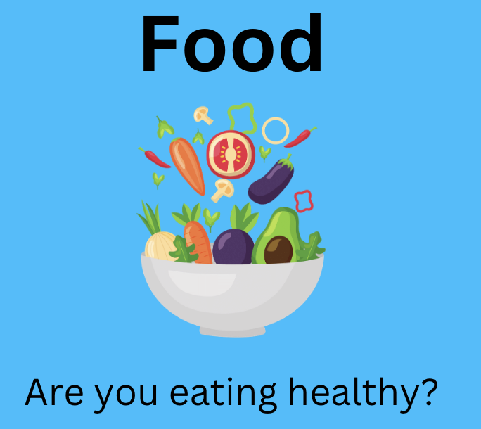

<html lang="en">

  <a href="tracking"><button class="btn">Daily</button></a>
  <a href="login"><button class="btn">Login</button></a>
    <a href="Register"><button class="btn">Register</button></a>
    

        

            
        

        

            
        

    

    

        

            
        

        

            
        

        

            
        

    

</html>

