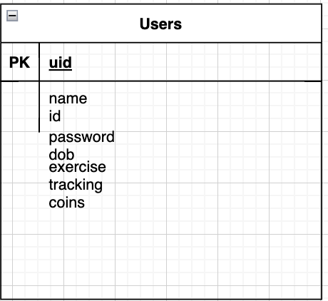

### JWT

## Work Completed
# Isabel - Scrum Master + Developer
- Responsible for: Create User, Exercise, Sleep, Coin system (w/Anusha), Team Management 
- Completed so far: Home Page (design + buttons), Basic Frontend + User Interaction/ Log (w/o backend integration + api) for Exercise + Sleep

** Updated Data Model **

# Justin - Devops + Developer
- Responsible for: AWS deployment, stress, CSP term connection page
- Completed: Stress Quiz + User Interaction (w/o backend integration), Github Deployment, SAS button bindings

Tangibles: 
[Stress Quiz](https://github.com/jplip/frontTri2/issues/20)
[AWS Deployment](https://github.com/jplip/frontTri2/issues/19)

# Anusha - Developer + Documentation
- Responsible for: Water, Food, Coin system (w/Anusha), Relaxation/Meditation Game, Commenting, Read Me
- Completed: Basic Front end + User Interaction/Log (w/o integration) for water, nutrition graphs with user interaction + USDA recommended for Food, Relaxation game front end integration (not posted yet on website but on repo), Relaxation game back end integration

Tangibles: 

# Vibha - Developer + User Interface
- Responsible for: Interuser interactions (profile cards), User profile, User profile set up, Badges
- Completed: User profile set up page + User Interaction (w/o backend integration), SAS button bindings, User Profile cars (work in progress), Login page front end (w/o backend integration)

Tangibles: 

# Story Map

Tangibles: 

## Why would CPT Like you project?

### Work in Progress/To do
[Github Schedule](https://github.com/users/iKAN2025/projects/2/views/1)

