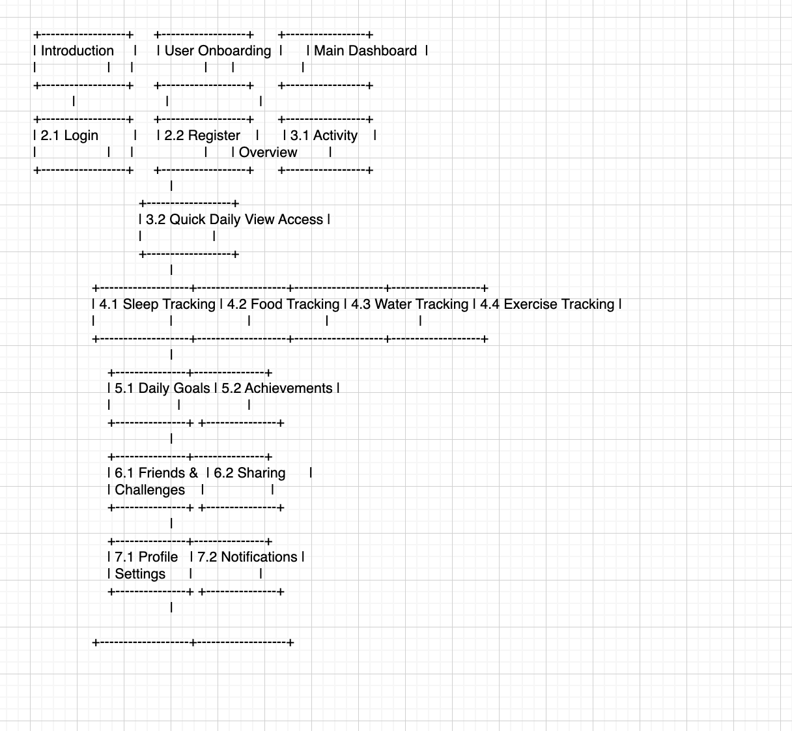

### JWT

## Work Completed
# Isabel - Scrum Master + Developer
- Responsible for: Create User, Exercise, Sleep, Coin system (w/Anusha), Team Management 
- Completed so far: Home Page (design + buttons), Basic Frontend + User Interaction/ Log (w/o backend integration + api) for Exercise + Sleep

**Updated Data Model**

[Login Issue](https://github.com/jplip/frontTri2/issues/1#issue-2000663269)

# Justin - Devops + Developer
- Responsible for: AWS deployment, stress, CSP term connection page
- Completed: Stress Quiz + User Interaction (w/o backend integration), Github Deployment, SAS button bindings

**Tangibles**

Tangibles: 
[Stress Quiz](https://github.com/jplip/frontTri2/issues/20)
[Stress Link Repo](https://jplip.github.io/frontTri2/stress/)
[AWS Deployment](https://github.com/jplip/frontTri2/issues/19)

# Anusha - Developer + Documentation
- Responsible for: Water, Food, Coin system (w/Anusha), Relaxation/Meditation Game, Commenting, Read Me
- Completed: Basic Front end + User Interaction/Log (w/o integration) for water, nutrition graphs with user interaction + USDA recommended for Food, Relaxation game front end integration (not posted yet on website but on repo), Relaxation game back end integration

**Tangibles**

[Water Tracker](https://jplip.github.io/frontTri2/water/)
[Food Tracker](https://jplip.github.io/frontTri2/food/)
[Casino Spinner](https://jplip.github.io/frontTri2/spinner/)

# Vibha - Developer + User Interface
- Responsible for: Interuser interactions (profile cards), User profile, User profile set up, Badges
- Completed: User profile set up page + User Interaction (w/o backend integration), SAS button bindings, User Profile cars (work in progress), Login page front end (w/o backend integration)

**Tangibles***

[Profile Page](https://github.com/jplip/frontTri2/issues/15)
[Profile Page](https://jplip.github.io/frontTri2/profile_set_up/)

## Story Map

## Why would Collegeboard like this project?

**Wellness Promotion:**
Encouraging physical activity aligns with the promotion of overall student well-being. A fitness tracker project could contribute to fostering a healthier lifestyle among students, which can positively impact their academic performance and general health.

**Data-Driven Insights:**
Fitness trackers generate data on students' physical activity levels, sleep patterns, and other health metrics. This data can be valuable for educational institutions to gain insights into students' well-being, potentially identifying trends or patterns that could inform campus wellness programs.

### Work in Progress/To do
[Github Schedule](https://github.com/users/iKAN2025/projects/2/views/1)

