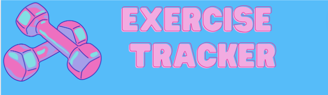

---
layout: base
title: Exercise
permalink: /exercise/
--- 

<html lang="en">

<head>
    <meta charset="UTF-8">
    <title>Exercise</title>
</head>
<body>
    

        

        <form id="exerciseForm">
            <label for="name">Name:</label>
            <input type="text" id="name" name="name" placeholder="Enter your name" required>
            <label for="exerciseType">Exercise Type:</label>
            <input type="text" id="exerciseType" name="exerciseType" placeholder="Enter exercise type" required>
            <label for="duration">Duration (in minutes):</label>
            <input type="number" id="duration" name="duration" placeholder="Enter duration" required>
            <label for="exerciseDate">Date of Exercise:</label>
            <input type="date" id="exerciseDate" name="exerciseDate" required>
            <input type="submit" value="Submit">
        </form>
    

    
    <iframe src="https://jplip.github.io/frontTri2/exercisegraph/" width="800" height="600" frameborder="0"></iframe>

</body>

</html>

