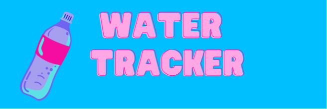

<html lang="en">
<head>
    <meta charset="UTF-8">
    <meta name="viewport" content="width=device-width, initial-scale=1.0">
    
</head>
<body>
    
    

        <label for="cupInput">Enter number of cups: </label>
        <input type="number" id="cupInput" min="0">
        <input type="submit" onclick="updateProgressBar()" value="Submit">
    

    

        

        
0 cups

    

    

    

        

    

    
</body>
</html>
