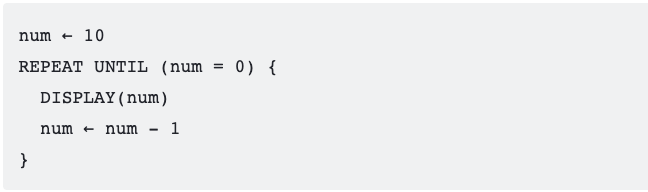
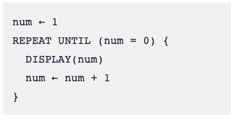

# What is an Undecidable Problem? (Bella)

Some problems take a very long time to solve, so we use algorithms that give approximate solutions. There are some problems that a computer can never solve, even the world's most powerful computer with infinite time: the undecidable problems.

- An decidable problem is a decision problem for which an algorithm can be written to produce a correct number for all inputs (eg: is the number even) (Collegeboard AAP-4.B.1)
- An undecidable problem is one for which no algorith can be constructed that is always capable of providing a correct yes-or-no answer. (Collegeboard AAP-4.B.2) An undecidable problem may have some instances  that have an algorthimic solution, but there is no algorithmic solution that could solve all instances of the problem. 

## Popcorn Hack 1

### 1. Review of the Definition of an Undecided Problem

 A company is developing a tool to detect "unreachable code": code in a program that will never be executed because no paths ever lead to that line of code. They want to release the tool with the promise that it will "find and delete 100% of the unreachable code in your codebase!" Unfortunately, one of the programmers does some research and realizes that determining whether a line of code is unreachable is an undecidable problem.

**What are the consequences of the problem being undecidable?**

**A.** The programmers can come up with an algorithm that will find 100% of the unreachable code, but it would take an unreasonable amount of time to run.

**B.** The programmers can come up with an algorithm that correctly determines unreachable code most of the time, but it will not correctly identify unreachable code in all cases.

**C.** The programmers may be able to come up with an algorithm to find 100% of the unreachable code, but nobody has come up with the algorithm yet, so they will need more development time.

**D.** The tool will not be able to correctly identify any cases of unreachable code.

  
Solution

  <strong>B</strong> is the correct answer as the definition of an undecided problem states that an algorithm may be able to solve the problem in some cases but no algorithm exists to solve all cases.  

# Halting Problem (Bella )

The Halting Problem is a classic example of an undecidable problem in computer science, formulated by Alan Turing in the 1930s. It addresses the fundamental question of whether a program, given any input, will eventually halt (terminate) or run indefinitely (enter an infinite loop).

The essence of the Halting Problem revolves around creating an algorithm that can accurately determine, for any program and input, whether that program will halt or continue running forever. Alan Turing proved that such an algorithm cannot exist.

For example, consider this program that counts down:

That program will halt, since num eventually becomes 0.
Compare that to this program that counts up:

It counts up forever, since num will never equal 0.
Algorithms do exist that can correctly predict that the first program halts and the second program never does. These are simple programs which don't change based on different inputs.
However, no algorithm exists that can analyze any program's code and determine whether it halts or not.

## Popcorn Hack 2

### 2. Review of the Halting Problem

Which of the following options best summarizes the Halting Problem?

**A.** The Halting Problem is a decision problem in computability theory that seeks to determine whether a given algorithm will halt or run indefinitely for all possible inputs.

**B.** The Halting Problem is a sorting algorithm designed to arrange elements in ascending order.

**C.** The Halting Problem is a protocol used to secure communications over the internet.

**D.** The Halting Problem is a theorem in number theory that deals with prime numbers.

  
Solution

  <strong>A</strong> is the correct answer as the Halting Problem was Turing's proof of the existence of an undecided problem.   

# Turing's Proof Through Contradiction: (Anusha)
defintion proof through contradiction: a form of proof that assumes a claim false and shows that this state leads to a known contradiction; therefore, the claim must be true
1. **We assume the halting algoritm exists**
So here's the basic code flowchart for the halting algorithm:

Here's the reverser (which consists of its halting algorithm) which basically does the opposite of the halting algoritm returns.

The Reverser works on programs such as Count Up or Count Down until 0.

2. **The contradiction**
But if we plug Reverser into itself....

**Reverser does the opposite of HaltChecker so HaltChecker can never be right.**

- Yellow path: If HaltChecker says that Reverser never halts; the Reverser will halt
- Green Path: If HaltCheck says Reverser halts; the Reverser will never halt

However, we said that HaltChecker exists and is always correct.
3. **Conclusion**
Therefore, HaltChecker cannot exist.

# Implications and Further Undecidable Problems (10 minutes):(Justin)
- **Consequences:** Discuss the implications of proving the Halting Problem as undecidable in the realm of computer science.
- **Additional Undecidable Problems:** Introduce other undecidable problems, highlighting their similarities to the Halting Problem.

- The Post Correspondence Problem (PCP)
- **Description:** Given a set of tiles with strings, the PCP seeks a sequence that concatenates to identical top and bottom strings.
- **Undecidability:** Turing demonstrated that no algorithm can determine this sequence for all sets of tiles.

- Rice's Theorem
- **Description:** Deals with non-trivial properties of program behavior.
- **Undecidability:** It states that determining properties like a program's output is undecidable.

- The Collatz Conjecture
- **Description:** Involves iterating a sequence based on a specific rule applied to a positive integer.
- **Undecidability:** Whether this sequence always reaches 1 from any starting number remains unsolved.

-  The Tiling Problem
- **Description:** Determines if a given shape can be tiled perfectly without gaps or overlaps.
- **Undecidability:** Proving whether an arbitrary shape can be tiled without gaps or overlaps is undecidable.

-- The Entscheidungsproblem
- **Description:** Focuses on determining the validity of logical statements within a logical system.
- **Undecidability:** Gödel, Church, and Turing proved the Entscheidungsproblem to be undecidable.

### 3. Review of Alternative Examples of Undecided Problems

Which of the following options is not an example of an undecided problem?

